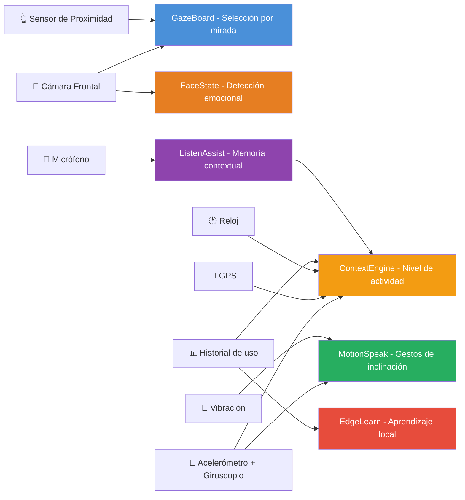
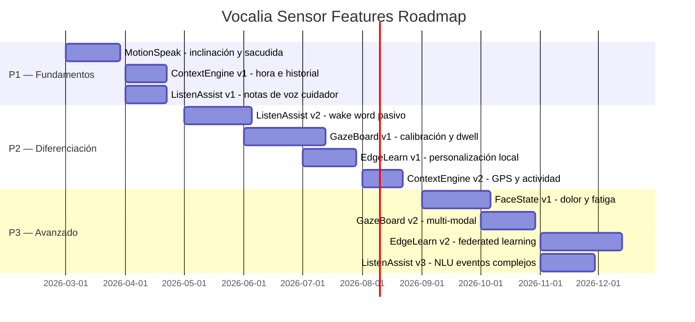

# Vocalia — Estrategia de Innovación con Sensores + IA

> Análisis multidisciplinar: Accesibilidad · Ingeniería de Sensores · Machine Learning · Diseño de Interacción · Rehabilitación Médica

---

## Contexto del Problema

Las apps AAC actuales (Proloquo2Go, TouchChat, TD Snap) comparten una limitación fundamental: **asumen que el usuario puede tocar con precisión un punto en la pantalla**. Para personas con parálisis cerebral, ELA, distrofia muscular o lesiones medulares, esta asunción es excluyente.

Vocalia tiene la oportunidad de romper esa barrera usando **exclusivamente los sensores estándar de un smartphone moderno**, sin hardware médico adicional.

---

## Los 6 Conceptos Innovadores

---

### 🔵 Concepto 1: GazeBoard — Selección por Mirada

**Problema real que resuelve:**
Usuarios con movilidad muy reducida (parálisis, ELA avanzada) no pueden tocar la pantalla. Los sistemas de eye tracking actuales cuestan 3.000–15.000€ (Tobii Dynavox). Vocalia podría ofrecer selección por mirada **gratis, con la cámara frontal del móvil**.

**Sensor:** Cámara frontal (infrarroja en Face ID o RGB estándar)

**Modelo de IA:**
- **MediaPipe Face Mesh** (468 landmarks faciales, on-device, <5ms)
- **MediaPipe Iris** (detección de iris + estimación de mirada)
- Modelo personalizado de **regresión de mirada** (~2MB TFLite) entrenado con calibración inicial del usuario (mirar 9 puntos en pantalla)

**Cómo funciona:**
1. Al arrancar, calibración rápida: el usuario sigue con la mirada 9 puntos (30 segundos)
2. El modelo mapea la posición del iris + orientación de la cabeza → coordenada en pantalla
3. El pictograma bajo la mirada se resalta progresivamente (dwell: 600–1200ms configurable)
4. Confirmación por **parpadeo prolongado** (>400ms) o por sensor de proximidad

**Diferenciación vs apps AAC:**
| Característica | Apps tradicionales | Vocalia GazeBoard |
|---|---|---|
| Hardware necesario | Tobii (3.000€+) | Cámara frontal del smartphone |
| Precisión | ~0.5° | ~2–3° (suficiente para pictogramas grandes) |
| Coste | Miles de euros | 0€ (software) |
| Portabilidad | Fijo a una mesa | En la mano, en una silla de ruedas |

**Viabilidad técnica: MEDIA-ALTA**
- MediaPipe Face Mesh + Iris: **disponible hoy**, funciona en Flutter vía plugin nativo
- Precisión de ~2–3° con cámara RGB es suficiente para una cuadrícula de 6–12 elementos
- Requiere calibración y buena iluminación
- Apple Vision framework ofrece eye tracking nativo desde iOS 18

> [!IMPORTANT]
> Esta es la funcionalidad con mayor potencial de impacto. Convierte un smartphone de 200€ en un comunicador de 15.000€.

---

### 🟢 Concepto 2: MotionSpeak — Confirmación por Movimiento

**Problema real que resuelve:**
Usuarios que pueden sostener el móvil pero no tocarlo con precisión. Necesitan una forma de decir "sí", "no", "borrar" sin tocar la pantalla. Actualmente no existe ninguna app AAC que use inclinación como input.

**Sensores:** Acelerómetro + Giroscopio (IMU 6 ejes)

**Modelo de IA:**
- **Clasificador LSTM ligero** (~500KB TFLite) entrenado para reconocer 4–6 gestos de inclinación
- Detección de umbral adaptativa que aprende el rango de movimiento del usuario

**Gestos reconocidos:**

| Gesto | Acción | Detección |
|---|---|---|
| Inclinar adelante | ✅ Confirmar / Seleccionar | Acelerómetro eje Y > umbral durante 300ms |
| Inclinar atrás | ❌ Cancelar / Borrar último | Acelerómetro eje Y < -umbral durante 300ms |
| Inclinar izquierda | ← Categoría anterior | Giroscopio eje Z rotación negativa |
| Inclinar derecha | → Categoría siguiente | Giroscopio eje Z rotación positiva |
| Sacudida leve (shake) | 🗑️ Borrar todo | Acelerómetro |pico| > 2g en 500ms |
| Doble inclinación | 🔊 Hablar ahora | Dos inclinaciones en <1s |

**Diferenciación real:**
- **Cero dependencia del toque** — el usuario solo necesita poder mover el teléfono ligeramente
- Umbrales adaptativos: el modelo aprende que "para María, inclinar 5° es su máximo; para Juan, 30°"
- Feedback háptico (vibración) confirma cada gesto reconocido

**Viabilidad técnica: ALTA**
- Acelerómetro/giroscopio disponibles en **todos** los smartphones desde 2012
- Flutter tiene paquete `sensors_plus` que da acceso directo a los datos
- Un clasificador LSTM de 6 gestos es trivial de entrenar con <100KB de datos
- Detección de umbral adaptativa es un problema resuelto

---

### 🟡 Concepto 3: ContextEngine — Predicción Anticipatoria

**Problema real que resuelve:**
Las apps AAC ofrecen siempre las mismas opciones sin importar si son las 7AM o las 11PM, si el usuario está en casa o en el hospital, si lleva 4 horas sin comer. **No tienen contexto**. El resultado: muchos toques para decir algo obvio.

**Sensores:** GPS + Reloj + Acelerómetro + Historial de uso

**Modelo de IA:**
- **Modelo de secuencia temporal** (Transformer pequeño, ~3MB TFLite) que aprende patrones del usuario
- Entrada: hora del día, día de la semana, ubicación (casa/colegio/hospital), última frase, tiempo desde última comida, nivel de actividad
- Salida: ranking personalizado de pictogramas y frases rápidas

**Ejemplo real de funcionamiento:**

```
🕐 7:30 AM + 📍 Casa + ⏰ Lunes
→ Pantalla principal muestra: "Buenos días" "Desayuno" "Zumo" "Quiero leche" "Estoy cansado"

🕐 13:00 + 📍 Colegio + Sin comer 5h
→ Pantalla principal muestra: "Tengo hambre" "Quiero comer" "Pizza" "Agua" "Ir al baño"

🕐 22:00 + 📍 Casa + Baja actividad (acelerómetro quieto)
→ Pantalla principal muestra: "Buenas noches" "Tengo sueño" "Me duele" "Agua" "Mamá"

🕐 15:00 + 📍 Hospital + 2ª visita en 7 días
→ Pantalla principal muestra: "Me duele" "Aquí" "Más" "Menos" "Estoy mejor"
```

**Diferenciación vs predicción estática (lo que Vocalia ya tiene):**

| Aspecto | Vocalia actual | ContextEngine |
|---|---|---|
| Predicción | Basada en el último pictograma | Basada en hora, lugar, historial, actividad |
| Personalización | General | Individual (aprende de cada usuario) |
| Requiere selección previa | Sí | No — predice ANTES del primer toque |
| Datos | Solo secuencia actual | 4 semanas de patrones |

**Viabilidad técnica: ALTA**
- GPS + reloj: universalmente disponibles
- Un Transformer pequeño (4 capas, 64 dim) cabe en ~3MB
- TFLite soporta Transformers y secuencias desde SDK r2.10
- La parte difícil es acumular suficientes datos de uso (requiere ~2–4 semanas de uso activo)

---

### 🟠 Concepto 4: FaceState — Detección de Estado Emocional y Físico

**Problema real que resuelve:**
Muchos usuarios de AAC no pueden expresar dolor, fatiga o frustración por sí solos. Un cuidador experimentado lee las expresiones faciales, pero un cuidador nuevo o un entorno desconocido (hospital, colegio nuevo) no puede. La app debería **detectar automáticamente estados críticos** y sugerir comunicarlos.

**Sensor:** Cámara frontal (análisis continuo en segundo plano)

**Modelo de IA:**
- **MediaPipe Face Mesh** → 468 landmarks
- Modelo de clasificación de expresiones (~1.5MB TFLite):
  - **Dolor**: ceño fruncido + ojos entrecerrados + comisuras hacia abajo
  - **Fatiga**: parpadeo frecuente + ojos semicerrados + cabeza inclinada
  - **Frustración**: mandíbula tensa + labios apretados + micro-sacudidas de cabeza
  - **Sonrisa/bienestar**: comisuras elevadas + pómulos arriba

**Cómo funciona:**

```
📸 Cámara detecta ceño fruncido + ojos entrecerrados durante >10 segundos
   ↓
🔔 La app muestra una sugerencia sutil:
   "¿Te duele algo?" → [Sí, me duele] [No, estoy bien]
   ↓
Si toca "Sí, me duele":
   → Muestra partes del cuerpo automáticamente
   → Auto-genera: "Me duele la cabeza"
```

**Detección de fatiga → ajuste automático:**

| Señal detectada | Adaptación automática |
|---|---|
| Parpadeo frecuente (>25/min) | Aumentar tamaño de pictogramas |
| Ojos semicerrados >5s | Ofrecer "¿Quieres descansar?" |
| Tiempo de reacción > 3x normal | Reducir opciones a 4 pictogramas esenciales |
| 0 interacción en >15min | Alertar al cuidador (notificación) |

**Viabilidad técnica: MEDIA**
- MediaPipe Face Mesh: funciona hoy, on-device, <5ms por frame
- Detección de dolor/fatiga requiere modelo personalizado, pero hay datasets públicos (AffectNet, FER2013, UNBC-McMaster Pain)
- **Riesgo**: los patrones faciales varían enormemente en personas con parálisis facial — requiere calibración individual
- Consumo de batería: analizar 2–3 frames/segundo es viable sin impacto severo

> [!WARNING]
> La detección de expresiones en personas con condiciones neuromusculares es significativamente más difícil que en la población general. El modelo DEBE ser calibrado individualmente y NUNCA debe asumir dolor sin confirmación del usuario.

---

### 🔴 Concepto 5: EdgeLearn — Aprendizaje Personalizado en Local

**Problema real que resuelve:**
Cada persona con dificultades de comunicación es única. María siempre dice "quiero agua" después de "me duele la barriga". Juan siempre pide jugar después del colegio. Las apps AAC genéricas ignoran estos patrones individuales. EdgeLearn **aprende de cada usuario en su propio dispositivo**, sin enviar datos a la nube.

**Arquitectura:**

```
┌─────────────────────────────────────────┐
│              SMARTPHONE                  │
│                                          │
│  ┌────────────────────────────────────┐  │
│  │  Modelo Base (pre-entrenado)       │  │
│  │  ~5MB TFLite                       │  │
│  │  → Predicciones generales AAC      │  │
│  └──────────┬─────────────────────────┘  │
│             │ Fine-tuning on-device       │
│  ┌──────────▼─────────────────────────┐  │
│  │  Capa de Personalización Local     │  │
│  │  ~200KB de pesos adaptativos       │  │
│  │  → Aprende patrones de ESTE usuario│  │
│  └──────────┬─────────────────────────┘  │
│             │                             │
│  ┌──────────▼─────────────────────────┐  │
│  │  Base de Datos Local (SQLite)      │  │
│  │  → Historial de uso encriptado     │  │
│  │  → Pesos del modelo personal       │  │
│  │  → Preferencias aprendidas         │  │
│  └────────────────────────────────────┘  │
│                                          │
│  ⛔ Nada sale del dispositivo             │
│  ✅ GDPR/HIPAA compliant by design       │
└─────────────────────────────────────────┘
```

**Modelo de IA:**
- **Modelo base**: red neuronal feed-forward o LSTM pequeña, pre-entrenada con datos anónimos de uso AAC
- **Personalización**: TFLite Model Personalization API (transfer learning on-device)
- **Métricas de aprendizaje**: secuencia de pictogramas, hora, contexto → próxima selección

**Qué aprende:**

| Patrón | Ejemplo | Resultado |
|---|---|---|
| Secuencias frecuentes | María siempre dice "quiero + agua" después de "comer" | "agua" aparece 1ª tras "comer" |
| Patrones temporales | Juan pide "jugar" a las 17:00 | A las 17:00, "jugar" sube al top |
| Vocabulario real | Laura nunca usa "taxi" ni "oficina" | Esos pictogramas bajan de prioridad |
| Velocidad de selección | Pedro tarda 3x más con pictogramas pequeños | Interfaz agranda automáticamente |
| Favoritos implícitos | Ana usa "hola" + "mamá" 12 veces/día | Se crea un acceso directo combinado |

**Privacidad por diseño:**
- **Todos los datos en local** — nunca se suben a la nube
- Los pesos del modelo personalizado están cifrados con la biometría del dispositivo
- **Federated Learning opcional**: si el usuario consiente, los gradientes (no los datos) se agregan anónimamente para mejorar el modelo base

**Viabilidad técnica: MEDIA-ALTA**
- TFLite Model Personalization: disponible desde TF 2.7
- Transfer learning on-device demostrado por Google en Gboard (predicción de texto personalizada)
- Requiere ~2–4 semanas de uso para personalización significativa
- El reto es la UX: el usuario debe percibir que la app "le conoce" sin ser intrusiva

---

### 🟣 Concepto 6: ListenAssist — Escucha Ambiental y Memoria Contextual

**Problema real que resuelve:**
A un niño con dificultades de comunicación le dicen cosas constantemente: "Marta, mañana vamos a casa de Lucía", "Marta, hoy tienes médico a las 4", "Marta, la abuela viene el domingo". Pero el niño **no puede hablar de ello después** — no tiene los pictogramas preparados, no recuerda los detalles, y la app no sabe nada de ese contexto. El resultado: el niño está **desconectado de su propia agenda y vida social**.

**Sensor:** Micrófono (escucha pasiva con wake word)

**Modelo de IA:**
- **Wake word detector** on-device (~300KB TFLite): detecta el nombre del niño ("Marta") como trigger, similar a "Hey Siri"
- **Speech-to-text** on-device: Google ML Kit / Whisper TFLite (~40MB) — transcribe solo DESPUÉS del trigger
- **Gemini API** (o modelo local): extrae entidades semánticas de la frase transcrita → persona, lugar, tiempo, actividad
- **Base de datos de contexto local**: almacena eventos estructurados

**Cómo funciona — Flujo completo:**

```
FASE 1: CAPTURA (pasiva)
═══════════════════════════════════════════════
La mamá dice: "Marta, mañana vamos a casa de Lucía"
                    │
    🎤 Wake word detectado: "Marta"
                    │
    📝 Transcripción: "mañana vamos a casa de Lucía"
                    │
    🧠 Extracción semántica:
        → evento: "visita"
        → persona: "Lucía"
        → lugar: "casa de Lucía"
        → tiempo: "mañana" → 2026-03-02
        → actividad: "ir"
                    │
    💾 Guardado en Memoria Contextual

FASE 2: ACTIVACIÓN (al día siguiente)
═══════════════════════════════════════════════
🕐 Es 2 marzo. La app detecta que hay un evento para hoy.
                    │
    ✨ Barra de sugerencias muestra:
    [🏠 Casa de Lucía] [👧 Lucía] [🚗 Ir] [😊 Bien]
                    │
    Marta toca [🏠 Casa de Lucía] + [😊 Bien]
                    │
    🗣️ Auto-speak: "Quiero ir a casa de Lucía, estoy contenta"


FASE 3: CONVERSACIÓN ENRIQUECIDA
═══════════════════════════════════════════════
Alguien le pregunta: "Marta, ¿qué hiciste ayer?"
                    │
    🎤 Wake word: "Marta" + contexto "ayer"
                    │
    ✨ Sugerencias automáticas basadas en historial:
    [🏠 Fui a casa de Lucía] [🎮 Jugamos] [😊 Me gustó]
                    │
    Marta puede CONTAR lo que hizo sin que nadie 
    le prepare los pictogramas.
```

**Tipos de contexto que captura y cómo los usa:**

| Lo que escucha | Qué guarda | Cómo lo usa después |
|---|---|---|
| "Marta, mañana vamos al médico" | `evento: médico, tiempo: mañana` | Muestra pictogramas de hospital ese día |
| "Marta, la abuela viene el domingo" | `persona: abuela, tiempo: domingo` | Ese día sugiere "hola abuela", "te quiero" |
| "Marta, hoy hay pescado para comer" | `comida: pescado, momento: comida` | A mediodía sugiere "pescado", "no quiero", "me gusta" |
| "Marta, tu amiga Sofía está enferma" | `persona: Sofía, estado: enferma` | Sugiere "¿cómo está Sofía?", "mejorar" |
| "Marta, vamos a comprar zapatos" | `actividad: comprar, objeto: zapatos` | Sugiere "zapatos", "me gustan", "estos" |

**Modo Cuidador — "Notas de voz rápidas":**

Para contextos donde el micrófono pasivo no es ideal, el cuidador puede **hablar directamente a la app**:

```
👨 Padre toca el botón 🎤 y dice:
   "Hoy en el cole Marta ha hecho un dibujo de un gato"
   
💾 Se guarda como evento del día
   
Cuando alguien le pregunte "¿Qué hiciste en el cole?":
✨ → [🎨 Dibujo] [🐱 Gato] [🏫 Cole] [😊 Me gustó]
```

**Arquitectura técnica:**

```
┌─────────────────────────────────────────────────┐
│  ESCUCHA PASIVA (siempre activa, ultra bajo consumo)  │
│  ┌──────────────┐                                      │
│  │ Wake Word    │ ← Solo detecta el nombre: "Marta"   │
│  │ ~300KB       │   No graba nada hasta el trigger     │
│  └──────┬───────┘                                      │
│         │ nombre detectado                              │
│  ┌──────▼───────┐                                      │
│  │ Speech-to-   │ ← Graba y transcribe 5–15 segundos   │
│  │ Text (local) │   después del trigger                 │
│  └──────┬───────┘                                      │
│         │ texto                                         │
│  ┌──────▼───────┐                                      │
│  │ NLU/Gemini   │ ← Extrae: persona, lugar, tiempo,    │
│  │ Extractor    │   actividad, sentimiento              │
│  └──────┬───────┘                                      │
│         │ evento estructurado                           │
│  ┌──────▼───────┐                                      │
│  │ Memoria      │ ← SQLite cifrada, con TTL            │
│  │ Contextual   │   Eventos expiran tras 7 días         │
│  └──────────────┘                                      │
└─────────────────────────────────────────────────┘
```

**Privacidad — La clave de todo:**

| Preocupación | Solución |
|---|---|
| "¿Está grabando todo?" | NO. Solo se activa con el wake word. El audio previo se descarta |
| "¿Se guarda el audio?" | NO. Solo la transcripción de texto, que se procesa y descarta |
| "¿Se sube a la nube?" | Solo si se usa Gemini API para extracción. Alternativa: NLU on-device |
| "¿Quién accede a los datos?" | Solo el dispositivo local. Cifrado con biometría |
| Indicador visual | LED/icono siempre visible cuando el micro está activo |

> [!IMPORTANT]
> ListenAssist transforma a la app de un "traductor de pictogramas" a un **copiloto social** que da al niño acceso a su propia vida — sus planes, sus experiencias, sus relaciones. Ninguna app AAC existente ofrece esto.

**Viabilidad técnica: MEDIA-ALTA**
- Wake word detection on-device: tecnología madura (Picovoice Porcupine, TFLite modelos, Google Speech)
- Speech-to-text local: Whisper tiny (~40MB) funciona on-device en smartphones 2023+
- Extracción de entidades: Gemini API o modelos NER locales (spaCy mobile, MediaPipe Text)
- **Reto principal**: consumo de batería del micrófono siempre activo. Solución: DSP de bajo consumo en chips modernos (Qualcomm, Apple Neural Engine)

---

## Mapa de Sensores → Funcionalidades



---

## Matriz de Viabilidad

| # | Concepto | Sensor Principal | Modelo IA | Viabilidad | Impacto | Prioridad |
|---|---|---|---|---|---|---|
| 1 | **GazeBoard** | Cámara frontal | MediaPipe Iris + TFLite | ⬛⬛⬛⬜ Media-Alta | ⬛⬛⬛⬛⬛ Máximo | 🥇 P1 |
| 2 | **MotionSpeak** | Acelerómetro + Giroscopio | LSTM TFLite | ⬛⬛⬛⬛ Alta | ⬛⬛⬛⬛ Alto | 🥇 P1 |
| 3 | **ContextEngine** | GPS + Reloj + Historial | Transformer TFLite | ⬛⬛⬛⬛ Alta | ⬛⬛⬛⬛ Alto | 🥈 P2 |
| 4 | **FaceState** | Cámara frontal | MediaPipe + clasificador | ⬛⬛⬛⬜ Media | ⬛⬛⬛⬜ Medio-Alto | 🥉 P3 |
| 5 | **EdgeLearn** | Todos (datos de uso) | TFLite Personalization | ⬛⬛⬛⬜ Media-Alta | ⬛⬛⬛⬛⬛ Máximo | 🥈 P2 |
| 6 | **ListenAssist** | Micrófono | Wake word + STT + NLU | ⬛⬛⬛⬜ Media-Alta | ⬛⬛⬛⬛⬛ Máximo | 🥇 P1 |

---

## Riesgos Éticos y Mitigación

### 1. Consentimiento y Autonomía
| Riesgo | Mitigación |
|---|---|
| El usuario no puede dar consentimiento informado | Protocolo de consentimiento multinivel: usuario + tutor legal + terapeuta |
| La app "decide" por el usuario | NUNCA actuar sin confirmación — siempre sugerir, nunca ejecutar |
| Dependencia tecnológica | Mantener siempre modo manual sin IA como fallback |

### 2. Privacidad y Datos Sensibles
| Riesgo | Mitigación |
|---|---|
| Datos de salud (expresiones de dolor) | Todo procesamiento on-device. Nada sale del teléfono |
| Datos de ubicación | GPS solo para contexto local, nunca se almacena historial de posiciones |
| Grabación facial continua | Sin grabación. Procesamiento frame a frame sin almacenamiento |
| **Micrófono pasivo graba conversaciones** | **Solo activo tras wake word. Audio descartado inmediatamente tras transcripción. Sin almacenamiento de audio. LED/icono siempre visible** |
| Cumplimiento GDPR/HIPAA | Privacidad por diseño. Sin servidor de datos personales |

### 3. Precisión y Seguridad Clínica
| Riesgo | Mitigación |
|---|---|
| Falso positivo de dolor → alarma innecesaria | Solo sugiere, nunca alerta sin confirmación del usuario |
| Gaze tracking impreciso → selección incorrecta | Dwell time configurable + confirmación por segundo canal |
| El modelo aprende patrones incorrectos | Botón "esto no es lo que quiero" para corrección explícita |
| **ListenAssist malinterpreta contexto** | **El niño siempre elige si usa la sugerencia. Los cuidadores pueden revisar/editar la memoria** |

> [!CAUTION]
> Vocalia es una **herramienta de comunicación**, no un dispositivo médico. La detección de dolor/fatiga es una sugerencia, no un diagnóstico.

---

## Diferenciación Real vs Apps AAC Existentes

| Aspecto | Proloquo2Go / TouchChat | Vocalia con Sensores |
|---|---|---|
| **Input** | Solo toque | Toque + mirada + inclinación + voz |
| **Predicción** | Estática (misma cuadrícula) | Contextual (hora, lugar, historial, emocional) |
| **Personalización** | Manual (terapeuta) | Automática (la app aprende) |
| **Accesibilidad motora** | Requiere precisión de toque | Funciona con movimiento mínimo |
| **Eye tracking** | 3.000–15.000€ adicionales | 0€ (cámara del smartphone) |
| **Datos del usuario** | Nube del proveedor | 100% en el dispositivo |
| **Detección de estados** | No existe | Detecta dolor, fatiga, frustración |
| **Adaptación UI** | No | Tamaño, opciones y velocidad se adaptan |
| **Memoria contextual** | ❌ No existe | ✅ **Escucha el contexto y lo recuerda** |
| **Agenda del niño** | ❌ No sabe | ✅ **Sabe qué va a pasar y ayuda a hablar sobre ello** |

---

## Roadmap de Implementación Sugerido



---

## Conclusión

Vocalia tiene la oportunidad de ser la **primera app AAC del mundo que convierte un smartphone estándar en un comunicador adaptativo multimodal**. No se necesita hardware adicional de miles de euros. Los sensores de cualquier smartphone de 200€ son suficientes para:

1. **Eliminar la barrera del toque preciso** (GazeBoard + MotionSpeak)
2. **Anticipar necesidades antes de que el usuario las exprese** (ContextEngine)
3. **Detectar estados críticos que el usuario no puede comunicar** (FaceState)
4. **Aprender y adaptarse a cada persona individual** (EdgeLearn)
5. **Dar al niño acceso a su propia vida** — sus planes, sus experiencias, sus relaciones (ListenAssist)

La combinación de estas capacidades posiciona a Vocalia no como "otra app de pictogramas", sino como un **copiloto social inteligente** que podría redefinir el estándar de la industria AAC.
