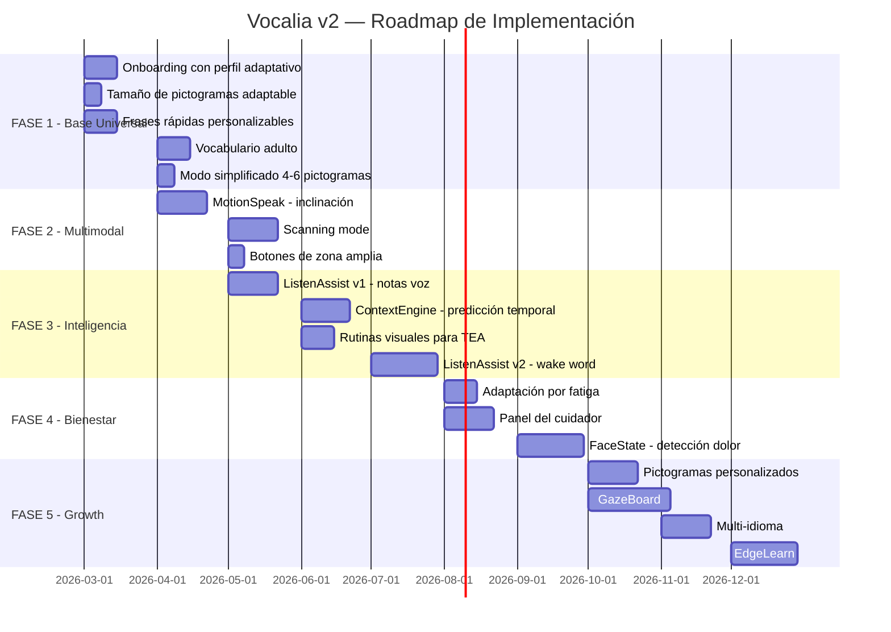

# Vocalia v2 — Plan Universal de Comunicación Asistida

> Plan multidisciplinar para que Vocalia sea útil al mayor número posible de personas con problemas de comunicación.

---

## ¿A quién debe servir Vocalia?

### Los 7 perfiles de usuario que cubrimos

| # | Perfil | Edad típica | Capacidad motora | Capacidad cognitiva | Input ideal |
|---|---|---|---|---|---|
| 🧒 A | **Parálisis cerebral infantil** | 3–18 | Muy limitada (puede no controlar manos) | Variable (a menudo intacta) | Mirada + inclinación |
| 🧩 B | **Trastorno del Espectro Autista (TEA)** | 3–adulto | Normal o buena | Variable. Dificultad social/verbal | Toque + pictogramas + rutinas |
| 💛 C | **Síndrome de Down** | 3–adulto | Buena pero imprecisa (manos grandes) | Moderada. Aprende con repetición | Toque con botones grandes + predicción |
| 🧓 D | **ELA / esclerosis múltiple** | Adultos | Degenerativa (empeora con el tiempo) | Intacta | Mirada → inclinación → toque (progresivo) |
| 🧠 E | **Afasia post-ictus** | Adultos | Normal | Dificultad para encontrar palabras | Pictogramas + IA generativa + ListenAssist |
| 💙 F | **Discapacidad intelectual** | Cualquier edad | Variable | Limitada. Necesita simplicidad | Pictogramas básicos + frases rápidas |
| 🔄 G | **Condiciones degenerativas** (Parkinson, demencia temprana) | Adultos mayores | Temblores, rigidez | Variable/declinante | Botones grandes + confirmación por voz + predicción |

> [!IMPORTANT]
> **Pregunta para ti**: ¿Cuál es la condición de tu sobrina? Con esa información puedo priorizar las funcionalidades que más le beneficien. Mientras tanto, el plan cubre todos los perfiles.

---

## Arquitectura de Modos Adaptativos

La clave no es hacer 7 apps diferentes, sino **una sola app que se adapte**. Al configurar el perfil del usuario, Vocalia activa el modo correcto:

```
┌─────────────────────────────────────────────────────────┐
│                    VOCALIA v2                             │
│                                                          │
│  ┌─────────────────────────────────────────────────┐     │
│  │           CAPA DE INTERACCIÓN                    │     │
│  │  ┌─────┐ ┌──────┐ ┌────────┐ ┌────────────┐    │     │
│  │  │Toque│ │Mirada│ │Inclin. │ │ Voz/Listen │    │     │
│  │  └──┬──┘ └──┬───┘ └───┬────┘ └─────┬──────┘    │     │
│  │     └───────┴─────────┴─────────────┘           │     │
│  │              ↓ Input unificado                   │     │
│  └─────────────────────────────────────────────────┘     │
│                                                          │
│  ┌─────────────────────────────────────────────────┐     │
│  │           CAPA DE INTELIGENCIA                   │     │
│  │  Predicción + Contexto + Memoria + EdgeLearn     │     │
│  └─────────────────────────────────────────────────┘     │
│                                                          │
│  ┌─────────────────────────────────────────────────┐     │
│  │           CAPA DE SALIDA                         │     │
│  │  Voz (TTS) + Texto + Vibración + Visual          │     │
│  └─────────────────────────────────────────────────┘     │
└─────────────────────────────────────────────────────────┘
```

### Configuración por perfil

| Perfil | Tamaño botones | Input primario | Predicción | Categorías | Auto-speak |
|---|---|---|---|---|---|
| 🧒 Parálisis cerebral | XXL (4 por pantalla) | Mirada + inclinación | Agresiva | Básico + emociones | 3s |
| 🧩 TEA | Grande | Toque | Rutinas + horario | Todas + personalizadas | 2s |
| 💛 Down | XL | Toque (zona amplia) | Frecuencia de uso | Simplificadas | 2.5s |
| 🧓 ELA | Adaptativo (crece con el tiempo) | Mirada → toque | Contextual | Todas | 2s |
| 🧠 Afasia | Normal | Toque | IA generativa fuerte | Vocabulario adulto | Manual |
| 💙 Discapacidad intelectual | XXL | Toque | Frases rápidas fijas | Mínimas (3–4) | 3s |
| 🔄 Degenerativo | XL + alto contraste | Toque + voz | Temporal + contextual | Adultas | 2.5s |

---

## Las 6 Fases de Implementación

### 📋 FASE 0: Configuración Inicial (el "Onboarding" que importa)

**Primera pantalla que ve el cuidador al instalar:**

```
 ┌────────────────────────────────────────┐
 │         Bienvenido a Vocalia           │
 │                                        │
 │   ¿Quién va a usar esta app?           │
 │                                        │
 │   Nombre: [Marta          ]            │
 │   Edad:   [8 años         ]            │
 │                                        │
 │   ¿Cómo se comunica mejor Marta?       │
 │                                        │
 │   ○ Puede tocar la pantalla            │
 │   ○ Puede mover el teléfono            │
 │   ○ Solo puede mirar                   │
 │   ○ No estoy seguro/a                  │
 │                                        │
 │   ¿Qué le cuesta más?                  │
 │                                        │
 │   ☑ Formar frases                      │
 │   ☑ Expresar dolor                     │
 │   ☑ Contar lo que ha hecho             │
 │   ☑ Pedir cosas                        │
 │                                        │
 │         [ Siguiente → ]                │
 └────────────────────────────────────────┘
```

**Resultado**: Vocalia configura automáticamente el perfil óptimo.

---

### 🏗️ FASE 1: Base Universal (lo que ya tenemos + mejoras)

**Objetivo**: Que la app sea funcional para el 80% de los usuarios desde el día 1.

| Funcionalidad | Estado | Para quién |
|---|---|---|
| Pictogramas por categorías (200+) | ✅ Hecho | Todos |
| Auto-speak (1.8s) | ✅ Hecho | Todos |
| Predicción por asociación (40+ reglas) | ✅ Hecho | Todos |
| **Tamaño de pictogramas adaptable** | 🔨 Por hacer | Parálisis, Down, discapacidad |
| **Frases rápidas personalizables** | 🔨 Por hacer | Todos (especialmente afasia) |
| **Modo simplificado (4–6 pictogramas)** | 🔨 Por hacer | Discapacidad intelectual, fatiga |
| **Vocabulario adulto** | 🔨 Por hacer | ELA, afasia, Parkinson |
| **Onboarding con perfil adaptativo** | 🔨 Por hacer | Todos |

---

### 🎯 FASE 2: Interacción Multimodal

**Objetivo**: Que el niño pueda usar la app sin tocar la pantalla.

| Funcionalidad | Para quién | Prioridad |
|---|---|---|
| **MotionSpeak** — Confirmar/cancelar por inclinación | Parálisis cerebral, ELA | 🥇 |
| **Scanning mode** — La app recorre opciones, el usuario confirma | Parálisis cerebral severa | 🥇 |
| **Botones de zona amplia** — Toque impreciso aceptado | Down, parálisis leve, Parkinson | 🥇 |
| **Switch access** — Compatible con pulsadores externos | Parálisis cerebral, ELA | 🥈 |
| **GazeBoard** — Selección por mirada | Parálisis cerebral, ELA avanzada | 🥈 |

---

### 🧠 FASE 3: Inteligencia Contextual

**Objetivo**: Que la app sea más lista que una cuadrícula estática.

| Funcionalidad | Descripción | Para quién |
|---|---|---|
| **ListenAssist v1** — Notas de voz del cuidador | El padre habla a la app: "Hoy vamos al parque" | Todos |
| **ListenAssist v2** — Wake word pasivo | Detecta "Marta" y captura contexto | Todos |
| **ContextEngine** — Predicción temporal | A las 8AM: desayuno. A las 22PM: dormir | Todos |
| **Rutinas visuales** — Agenda diaria con pictogramas | Para TEA: estructura = tranquilidad | TEA, discapacidad |
| **EdgeLearn** — Aprendizaje personalizado local | Aprende que Marta siempre pide agua tras comer | Todos |

---

### 💜 FASE 4: Detección y Bienestar

**Objetivo**: Que la app proteja al usuario.

| Funcionalidad | Descripción | Para quién |
|---|---|---|
| **FaceState** — Detección de dolor/fatiga | Sugiere "¿Te duele?" si detecta ceño fruncido | Parálisis, discapacidad |
| **Adaptación por fatiga** — UI se simplifica | Si el usuario tarda mucho, reduce opciones | Todos |
| **Panel del cuidador** — Resumen diario | Qué ha comunicado, cuándo, con qué frecuencia | Cuidadores, terapeutas |
| **Alertas configurables** — Sin comunicación en X tiempo | Notifica al cuidador si hay silencio prolongado | Todos |

---

### 🚀 FASE 5: Crecimiento y Comunidad

**Objetivo**: Que Vocalia crezca con cada usuario.

| Funcionalidad | Descripción |
|---|---|
| **Pictogramas personalizados** — Fotos propias como pictograma | La foto del gato de Marta, su aula, su abuela |
| **Compartir tableros** — Un terapeuta crea un tablero y lo comparte | Ahorra configuración |
| **Multi-idioma** — Español, catalán, inglés, francés | Familias bilingües |
| **Exportar historial** — PDF para el terapeuta/médico | "Estas son las 50 frases más frecuentes de Marta" |
| **PWA + nativo** — Funciona offline en iOS, Android, web | Sin app store para empezar |

---

## El Caso Específico de tu Sobrina

Para personalizar al máximo el plan, necesito saber:

1. **¿Qué condición tiene?** (parálisis cerebral, TEA, Down, otra...)
2. **¿Qué edad tiene?**
3. **¿Puede tocar la pantalla?** ¿Con precisión o de forma imprecisa?
4. **¿Entiende los pictogramas/imágenes?** ¿Reconoce fotos propias?
5. **¿Usa ya algún sistema de comunicación?** (pictogramas físicos, PECS, otra app)
6. **¿Qué es lo que más le cuesta comunicar?** (dolor, deseos, experiencias, emociones)

Con esas respuestas, puedo:
- Configurar el **perfil adaptativo exacto** para ella
- Priorizar las **funcionalidades que más impacto** tengan en su caso
- Crear **pictogramas personalizados** con las cosas de su vida real

---

## Prioridades de Implementación Inmediata

Basándome en lo que más impacto tiene para el mayor número de perfiles:



---

## Diferenciación Real: ¿Por qué Vocalia y no Proloquo2Go?

| Problema | Proloquo2Go (299€) | Vocalia |
|---|---|---|
| "Mi hija no puede tocar la pantalla" | Necesitas comprar Tobii (5.000€) | GazeBoard + MotionSpeak (gratis) |
| "Necesita pictogramas diferentes según la hora" | Siempre la misma cuadrícula | ContextEngine adapta por hora/lugar |
| "No puede contar lo que hizo en el cole" | Imposible sin preparar pictogramas | ListenAssist captura contexto |
| "Solo tiene 3 pictogramas básicos que usa" | Manual: el terapeuta cambia la cuadrícula | EdgeLearn reordena automáticamente |
| "Se cansa y luego ya no la usa" | No detecta fatiga | FaceState + adaptación automática |
| "Es caro y solo funciona en iPad" | 299€, solo iOS | **Gratis, web + iOS + Android** |
